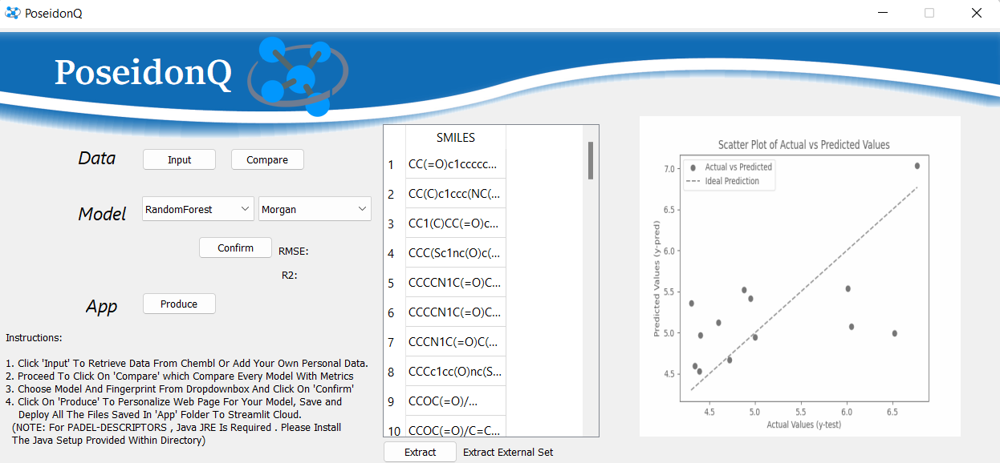
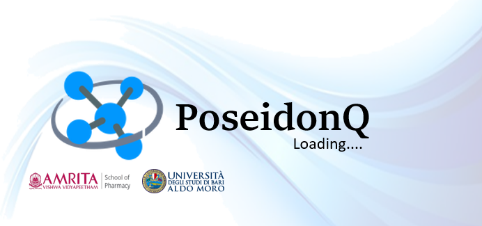

<p align="left" width="100%">
    
    
</p>

# PoseidonQ
<h3>Personal Optimization Software for Efficient Implementation and Derivation of ONline QSAR</h3>
<p>Download By Clicking on the Green Button Below(Available For Windows OS & Linux ubuntu (22.04 and above):</p>
<a href="https://sourceforge.net/projects/poseidonq/files/latest/download"></a>

<p><br>This Software was made with an intention to make QSAR building more efficient and reproducible.<br>Simple to use and no compromise on essential features necessary to make reliable QSAR models</p>
<h4>Step by Step - Process</h4>
<li>Extraction of Data From ChEMBL Database or Users In-House Data</li>
<li>Automatic Processing of Y-Label Depending TASK(Regression\Classification) according to users preferences</li>
<li>Defining Applicability Domain (FP - Tanimoto Similarity & Descriptors - Bounding Box)</li>
<li>Comparing Data in different ML Models with Metrics (R2/RMSE) or MCC with setting K-Fold split and Low variance threshold</li>
<li>Recursive Feature Elimination (Backward Feature Selection)</li> 
<li>Contains 22 ML Models and 16 FP from PadelPy, RDkit and CSFP with RDkit Molecular Descriptors</li>
<li>Choose ML model or Descriptor/FP of choice to build model (Automatic Internal Validation(R2/RMSE & Accuracy, Sensitivity, Specificity and MCC))</li>
<li>Convert QSAR model to WebApp (Automatic External Validation(if Value/Bioactivity Column exists), Multiple SMILES Screening and Single SMILES input) </li>
<li>Upload the App Folder Files in GitHub Repository , and link to Streamlit to launch your own QSAR app</li>

# GUI

<p align="left" >
    
</p>

# Installation
<h3>For Windows</h3>
<p>You can install PoseidonQ in Windows OS by downloading installer from Sourceforge.</p><a href=https://sourceforge.net/projects/poseidonq/>Click Here to get Setup Installer</a>
<h3>For Linux</h3>
<p>The Software has been built for ubuntu 22.04 & more , packaged as .deb file. This can be downloaded from Sourceforge.</p><a href=https://sourceforge.net/projects/poseidonq/>Click Here to get Debian Package</a>

<p><br><b>After downloading DEB file:</b></p>

```sh
#terminal
cd to location of your deb file
```
```sh
chmod +x PoseidonQ-app-0.0.1.deb
```
```sh
sudo apt install PoseidonQ-app-0.0.1
```
<p><b>To install in a DIR instead of bin, then:</b></p>

```sh
#terminal
cd to location of your deb file
```
```sh
chmod +x PoseidonQ-app-0.0.1.deb
```
```sh
dpkg --instdir {specify a dir} -i PoseidonQ-app-0.0.1.deb
```
# Instruction to Note
<li>Input Value in nM only, incase utilizing in-house data, automatic conversion to pIC50(regression) or binarization(classification)</li>
<li>Input Columns are SMILES and Value</li>
<li>Java JRE setup is provided within software directory, install it to use PadelPy descriptors</li>
<li>Choose same Fingerprint/Descriptors for AD Definition, Comparison and Building Model</li>
<li>For External validation, Value column for Regression models and Bioactivity column for Classification models. Here Value must in pIC50 and Bioactivity in binarized format </li>

# Authors

<li>Muzammil Kabier</li>
<li>Nicola Gambacorta</li>
<li>Sunil Kumar</li>
<li>Prof. Dr. Orazio Nicolotii</li>
<li>Prof. Dr. Bijo Mathew</li>

<p align="left" >
    
</p>

